The Do-It-Yourself (DIY) [Factory of Modern Originals (FoMO)](https://github.com/profilepic/originals) Presents

# Text-To-Image Generation Gems / Libraries

- [**moonbirds (& lil'moonbirdies)**](moonbirds) - generate your own 42×42 (or lil' 24×24) pixel owl images (off-blockchain) from text attributes (via built-in spritesheet); incl. 2x/4x/8x zoom for bigger sizes and more    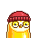 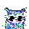 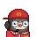,  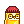 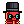 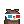
- [**cyberpunks**](cyberpunks) - generate your own cyberpunk (blade runner) sci-fi 32×32 pixel avatar images (off-blockchain) from text attributes (via built-in spritesheet); incl. 2x/4x/8x zoom for bigger sizes and more     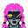 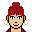
- [**nouns**](nouns) - generate your own 32×32 pixel avatar images (off-blockchain) from text attributes (via built-in spritesheet); incl. 2x/4x/8x zoom for bigger sizes and more    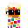 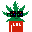 
- [**beaux & belles**](belles) - generate your own 24×24 beau & belle (pixel) head avatars images (off-blockchain) from text attributes (via built-in spritesheet); incl. 2x/4x/8x zoom for bigger sizes and more   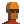 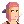 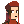
- [**coolcats**](coolcats) - generate your own 24×24 pixel cat images (off-blockchain) from text attributes (via built-in spritesheet); incl. 2x/4x/8x zoom for bigger sizes and more     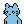  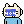
- [**shiba-inus**](shibainus) - generate your own 24×24 pixel shiba inu doge images (off-blockchain) from text attributes (via built-in spritesheet); incl. 2x/4x/8x zoom for bigger sizes and more       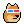 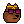 
- [**goblins (& lil'goblins)**](goblins) - generate your own 24×24 goblins or 20×20 lil'goblins (pixel) monster avatars images (off-blockchain) from text attributes (via built-in spritesheets); incl. 2x/4x/8x zoom for bigger sizes and more       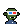 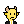 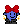,  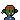 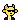 
- [**readymades (punk 1/1s)**](readymades) - generate your own 24×24 pixel punk images (off-blockchain) from 1/1 originals incl. William Shakespare, Galileo Galilei, Mao Zedong, The Mask, The Joker, Bard Simpson, and many other readymade public world figures or cinema (fictional or cartoon) characters and add attributes / accessories with text (via built-in spritesheet); incl. 2x/4x/8x zoom for bigger sizes and more   
    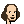 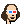 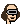   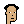  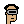 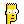 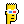 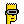   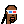 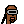
- [**smileys (smilies)**](smileys) - generate your own 24×24 pixel smiley images (off-blockchain) from text attributes (via built-in spritesheets); incl. 2x/4x/8x zoom for bigger sizes and more   
     

## License

The scripts are dedicated to the public domain.
Use it as you please with no restrictions whatsoever.

## Questions? Comments?

Post them on the [D.I.Y. Punk (Pixel) Art reddit](https://old.reddit.com/r/DIYPunkArt). Thanks.

