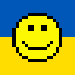
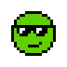
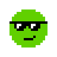

The Do-It-Yourself (DIY) [Factory of Modern Originals (FoMO)](https://github.com/profilepic/originals) Presents


# Smileys (Smilies)

Yes, you can! Generate your own 24×24 pixel smiley images (off-blockchain) with text (via built-in spritesheets); incl. 2x/4x/8x zoom for bigger sizes and more


* home  :: [github.com/profilepic/text-to-image](https://github.com/profilepic/text-to-image)
* bugs  :: [github.com/profilepic/text-to-image/issues](https://github.com/profilepic/text-to-image/issues)
* gem   :: [rubygems.org/gems/smileys](https://rubygems.org/gems/smileys)
* rdoc  :: [rubydoc.info/gems/smileys](http://rubydoc.info/gems/smileys)


##  Usage

Note:  The smileys in a 24x24 canvas come
in four diverent size variants -  with
the smiley circle with a diameter of 15px, 16px, 17px and 20px.


Let's generate some super-rare never-before-seen
smileys / smilies:

```ruby
require 'smileys'


smiley  = Smiley::Image.generate( "Yellow", "Face 1" )
smiley.save( "smiley1.png" )
smiley.zoom( 4 ).save( "smiley1@4x.png" )

base = smiley

smiley = base.background( 'ukraine' )
smiley.save( "smiley1.1.png" )
smiley.zoom( 4 ).save( "smiley1.1@4x.png" )

smiley = base.background( 'rainbow' )
smiley.save( "smiley1.2.png" )
smiley.zoom( 4 ).save( "smiley1.2@4x.png" )


# no - no outline variant
smiley  = Smiley::Image.generate( "Yellow.No", "Face 1" )
smiley.save( "smiley1b.png" )
smiley.zoom( 4 ).save( "smiley1b@4x.png" )

# (re)try with eyes + mouth
smiley  = Smiley::Image.generate( "Yellow", "Open", "Smile" )
smiley.save( "smiley1c.png" )
smiley.zoom( 4 ).save( "smiley1c@4x.png" )
```

Voila!


4x:





```ruby
smiley = Smiley::Image.generate( "Greener", "Face 2" )
smiley.save( "smiley2.png" )
smiley.zoom( 4 ).save( "smiley2@4x.png" )

smiley = Smiley::Image.generate( "Greener.No", "Face 2" )
smiley.save( "smiley2b.png" )
smiley.zoom( 4 ).save( "smiley2b@4x.png" )

# (re)try with eyes + mouth
smiley  = Smiley16::Image.generate( "Greener", "Shades", "Grin (Right)" )
smiley.save( "smiley2c.png" )
smiley.zoom( 4 ).save( "smiley2c@4x.png" )
```

Voila!


4x:





And so on.


## Questions? Comments?

Post them on the [D.I.Y. Punk (Pixel) Art reddit](https://old.reddit.com/r/DIYPunkArt). Thanks.

